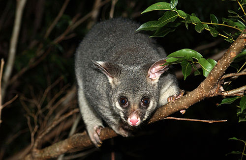

---
jupyter:
  jupytext:
    text_representation:
      extension: .Rmd
      format_name: rmarkdown
      format_version: '1.2'
      jupytext_version: 1.10.2
  kernelspec:
    display_name: Python 3
    language: python
    name: python3
---


<br>
<br>
<br>
<br>

# Logistic Regression Practice
**Possums**



*The common brushtail possum (Trichosurus vulpecula, from the Greek for "furry tailed" and the Latin for "little fox", previously in the genus Phalangista) is a nocturnal, semi-arboreal marsupial of the family Phalangeridae, native to Australia, and the second-largest of the possums.* -[Wikipedia](https://en.wikipedia.org/wiki/Common_brushtail_possum)

```{python}
# Imports

```

### Get the data

Read in the `possum.csv` data (located in the `data` folder).

```{python}

```

```{python}

```

### Preprocessing

> Check for & deal with any missing values.  
Convert categorical columns to numeric.  
Do any other preprocessing you feel is necessary.

```{python}

```

```{python}

```

```{python}

```

```{python}

```

### Modeling

> Build Logistic Regression model to predict `pop`; region of origin.  
Examine the performance of the model.

```{python}

```

```{python}

```

```{python}

```

```{python}

```

### Interpretation & Predictions

> Interpret at least one coefficient from your model.  
> Generate predicted probabilities for your testing set.  
> Generate predictions for your testing set.

```{python}

```

```{python}

```

```{python}

```

```{python}

```
