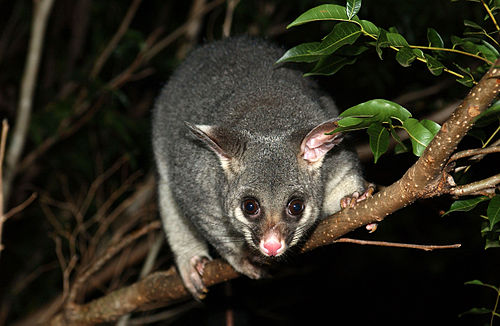

---
jupyter:
  jupytext:
    text_representation:
      extension: .Rmd
      format_name: rmarkdown
      format_version: '1.2'
      jupytext_version: 1.10.2
  kernelspec:
    display_name: Python 3
    language: python
    name: python3
---


<br>
<br>
<br>
<br>

# Logistic Regression Practice
**Possums**



*The common brushtail possum (Trichosurus vulpecula, from the Greek for "furry tailed" and the Latin for "little fox", previously in the genus Phalangista) is a nocturnal, semi-arboreal marsupial of the family Phalangeridae, native to Australia, and the second-largest of the possums.* -[Wikipedia](https://en.wikipedia.org/wiki/Common_brushtail_possum)

```{python}
# Imports
import numpy as np
import pandas as pd
import matplotlib.pyplot as plt
import seaborn as sns

from sklearn.linear_model import LogisticRegression
from sklearn.model_selection import train_test_split
```

### Get the data

Read in the `possum.csv` data (located in the `data` folder).

```{python}
possums = pd.read_csv('../data/possum.csv')
```

```{python}
possums.head()
```

### Preprocessing

> Check for & deal with any missing values.  
Convert categorical columns to numeric.  
Do any other preprocessing you feel is necessary.

```{python}
# Check for missings
possums.isnull().sum()
```

```{python}
# Drop missings
possums.dropna(inplace = True)
```

```{python}
# Convert sex m/f to 0/1
possums['sex_f'] = possums['sex'].map({'m': 0, 'f': 1})
possums.drop(columns = 'sex', inplace = True)
```

```{python}
# Check out the pop column
possums['pop'].value_counts()
```

```{python}
# convert pop column to 0/1\
possums['pop'] = possums['pop'].map({'other': 0, 'Vic': 1})
```

### Modeling

> Build Logistic Regression model to predict `pop`; region of origin.  
Examine the performance of the model.

```{python}
# Set up X and y
X = possums.drop(columns = 'pop')
y = possums['pop']

X_train, X_test, y_train, y_test = train_test_split(X, y, random_state = 42)
```

```{python}
# Instantiate model
logreg = LogisticRegression(solver = 'newton-cg') # changing solver b/c of convergence warning
```

```{python}
# Fit the model
logreg.fit(X_train, y_train)
```

```{python}
# training accuracy
logreg.score(X_train, y_train)
```

```{python}
# testing accuracy
logreg.score(X_test, y_test)
```

### Interpretation & Predictions

> Interpret at least one coefficient from your model.  
> Generate predicted probabilities for your testing set.  
> Generate predictions for your testing set.

```{python}
# Check out coefficients
pd.Series(logreg.coef_[0], index = X.columns)
```

```{python}
# Interpret coefficient for age:
np.exp(0.085753)
```

> A 1 year increase in a possum's age suggests that it is 1.09 times as likely to live in the Vic region, holding all else constant.

```{python}
# Predicted probabilities for test set
logreg.predict_proba(X_test)
```

```{python}
# Predictions for test set
logreg.predict(X_test)
```
