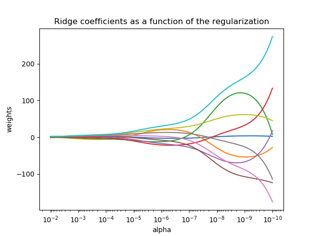

---
jupyter:
  jupytext:
    text_representation:
      extension: .Rmd
      format_name: rmarkdown
      format_version: '1.2'
      jupytext_version: 1.10.2
  kernelspec:
    display_name: Python 3
    language: python
    name: python3
---


<br>
<br>
<br>
<br>

# Introduction to Regularization

_Authors:_ Mahesh


## Learning Objectives

1. Describe what a loss function is.
2. Define regularization.
3. Describe and differentiate LASSO and Ridge regularization.
4. Understand how regularization affects the bias-variance tradeoff.
5. Implement LASSO regression and Ridge regression.


## Review

<details><summary>What is the bias-variance tradeoff?</summary>

- Mean squared error can be decomposed into a bias component plus a variance component (plus a systematic error, but we don't have control over this part, so we often ignore it).
- The bias-variance tradeoff refers to the fact that taking steps to minimize bias usually comes at the expense of an increase in variance. Similarly, taking steps to minimize variance usually comes at the expense of an increase in bias.

</details>

---

<details><summary>What evidence/information would lead me to believe that my model suffers from high variance?</summary>
    
- After splitting my data into training and testing sets, if I see that my model performs way better on my training set than my testing set, this means that my model is not generalizing very well to "new" data.
- An example might be where our training MSE is substantially lower than our testing MSE, or where our training R-squared is substantially higher than our testing R-squared.
</details>


## Why is high variance bad?

High variance is bad because it means that our model doesn't generalize well to new data. This means that our model looks as though it performs well on our training data but won't perform as well on new, unseen data.

---
<details><summary>How might we try to fix a model that suffers from high variance?</summary>

- Gather more data. (Although this is usually expensive and time-consuming.)
- Drop features.
- Make our existing features less complex. (i.e. get rid of interaction terms or higher order terms.)
- Choose a simpler model.
- Regularization!
</details>


## Pop Math Quiz

### Problem 1
**What is the value of $b$ that minimizes...**

$$ (y - b)^2 $$

<details><summary></summary>
When $b = y$, this expression has value 0. Since it's squared, it can't go below that.
</details>

### Problem 2
**What is the value of $b$ that minimizes...**

$$ (y - b)^2 + \alpha b^2 $$

where $\alpha > 0$?

<details><summary></summary>
This is more complicated, isn't it? You can use calculus and come up with an answer:
    
$$ \hat{b} = \frac{y}{1 + \alpha} $$

But what is the effect of $\alpha$ on our solution?
</details>


## Overview of regularization

---

**Regularizing** regression models is to:
- **automatically** avoid overfitting 
- **while** we fit our model
- by adding a "penalty" to our loss function.

### Before regularziation (OLS):

$$
\begin{align}
\text{minimize: MSE} &= \textstyle\frac{1}{n}\sum (y_i - \hat{y}_i)^2 \\ \\
                     &= \textstyle\frac{1}{n}\|\mathbf{y} - \hat{\mathbf{y}}\|^2 \\ \\
                     &= \textstyle\frac{1}{n}\|\mathbf{y} - \mathbf{X\beta}\|^2
\end{align}
$$

### After regularization (Ridge):

$$
\begin{align}
\text{minimize: MSE + penalty} &= \textstyle\frac{1}{n}\sum (y_i - \hat{y}_i)^2 + \alpha \sum \beta_j^2 \\ \\
                               &= \textstyle\frac{1}{n}\|\mathbf{y} - \hat{\mathbf{y}}\|^2 + \alpha \|\beta\|^2 \\ \\
                               &= \textstyle\frac{1}{n}\|\mathbf{y} - \mathbf{X}\hat{\beta}\|^2 + \alpha \|\beta\|^2
\end{align}
$$

Adding this penalty term onto the end and then minimizing has a similar effect to the one described above. That is, **ridge regression shrinks our regression coefficients closer to zero to make our model simpler**. We are accepting more bias in exchange for decreased variance. We'll be tasked with picking the "best" $\alpha$ that optimizes this bias-variance tradeoff.

### Other Variations

| Name | Loss Function |
| --- | --- |
| OLS | MSE |
| Ridge Regression | MSE + $\alpha\|\beta\|^2_2$ |
| LASSO Regression | MSE + $\alpha\|\beta\|_1$ |
| $L_q$-Regression | MSE + $\alpha\|\beta\|^q_q$ |

### Sidenote on notation:
We'll be using $\alpha$ to denote our **regularization parameter**, since that's what Scikit-Learn uses. However, this is contrary to data science literature. It is normally denoted with a $\lambda$. Why? Only Google knows.

### [Neat parameter space visualization!](https://timothykbook.shinyapps.io/RegularizationPlot/)


## What is the effect of regularization?

---

**To demonstrate the effects of regularization, we will be using a dataset on wine quality.**

### Load the wine .csv

This version has red and white wines concatenated together and tagged with a binary 1/0 indicator (1 is red wine). There are many other variables purportedly related to the rated quality of the wine.

```{python}
import pandas as pd
import numpy as np
import matplotlib.pyplot as plt
import seaborn as sns

sns.set_style('darkgrid')
```

```{python}
# Load in the wine .csv.
wine = pd.read_csv('datasets/winequality_merged.csv')

# Convert all columns to lowercase and replace spaces in column names.
wine.columns = wine.columns.str.lower().str.replace(' ', '_')
```

```{python}
# Check the first five rows.
wine.head()
```

```{python}
# How big is this dataset?
wine.shape
```

```{python}
# Check for missing values.
wine.isnull().sum()
```

```{python}
from sklearn.preprocessing import PolynomialFeatures

# Create X and y.
X = wine.drop('quality', axis=1)
y = wine['quality']

# Instantiate our PolynomialFeatures object to create all two-way terms.
poly = PolynomialFeatures(degree=2, interaction_only=False, include_bias=False)

# Fit and transform our X data.
X_overfit = poly.fit_transform(X)
```

```{python}
poly.get_feature_names(X.columns)
```

```{python}
# Check out the dimensions of X_overfit.
X_overfit.shape
```

#### Let's split our data up into training and testing sets. Why do we split our data into training and testing sets?

```{python}
# Import train_test_split.
from sklearn.model_selection import train_test_split
from sklearn.preprocessing import StandardScaler
```

```{python}
# Create train/test splits.
X_train, X_test, y_train, y_test = train_test_split(
    X_overfit,
    y,
    test_size=0.7,
    random_state=42
)
```

```{python}
# Scale our data.
# Relabeling scaled data as "Z" is common.
sc = StandardScaler()
Z_train = sc.fit_transform(X_train)
Z_test = sc.transform(X_test)
```

```{python}
print(f'Z_train shape is: {Z_train.shape}')
print(f'y_train shape is: {y_train.shape}')
print(f'Z_test shape is: {Z_test.shape}')
print(f'y_test shape is: {y_test.shape}')
```

## Standardizing predictors is required

Let's remind ourselves of our new loss function:

$$MSE + \alpha \|\beta\|^2$$

<details><summary>Why do you think regularization is required?</summary>
Recall that the size of each coefficient depends on the scale of its corresponding variable. Our penalty term depends on these coefficients. Scaling is required so that the regularization penalizes each variable equally fairly.
</details>


## But First: OLS

```{python}
# Import the appropriate library and fit our OLS model.

from sklearn.linear_model import LinearRegression
```

```{python}
ols = LinearRegression()
ols.fit(Z_train,y_train)
```

```{python}
# How does the model score on the training and test data?
print(ols.score(Z_train,y_train))
print(ols.score(Z_test,y_test))
```

```{python}
ols.coef_
```

(THREAD) What do these $R^2$s tell you?


## And Now: Ridge

### Let's think about this...

$$ \|\mathbf{y} - \mathbf{X}\beta\|^2 + \alpha\|\beta\|^2 $$

<details><summary>What's the optimal value of $\beta$ when $\alpha = 0$?</summary>
Our problem reduces to OLS, so it's the good old fashioned OLS solution! For the math nerds playing along from home, that's:
    
$$ \hat{\beta} = (\mathbf{X}^T\mathbf{X})^{-1}\mathbf{X}^T\mathbf{y} $$
</details>

<details><summary>What's the optimal value of $\beta$ when $\alpha = \infty$?</summary>
Anything besides $\hat{\beta} = \mathbf{0}$ will cause our whole loss function to be $\infty$. So, it must be that $\hat{\beta} = \mathbf{0}$!
</details>

<details><summary>Some facts...</summary>
$\alpha$ is a constant for the _strength_ of the regularization parameter. The higher the value, the greater the impact of this new component in the loss function. If the value was zero, we would revert back to just the least squares loss function. If the value was a billion, however, the residual sum of squares component would have a much smaller effect on the loss/cost than the regularization term.
</details>


### We can look at a traceplot to see this:




### Ok, so which $\alpha$ is best?

We'll primarily choose the optimal $\alpha$ via **cross validation**.

```{python}
# Ridge regressor lives here:
from sklearn.linear_model import Ridge
```

```{python}
# Instantiate.
ridge_model = Ridge(alpha=10)

# Fit.
ridge_model.fit(Z_train,y_train)

# Evaluate model using R2.
print(ridge_model.score(Z_train,y_train))
print(ridge_model.score(Z_test,y_test))

```

(THREAD) What do these $R^2$s tell you?


## Defining the LASSO

LASSO regression is largely the same as ridge, except with a different penalty term.

$$
\begin{align}
\text{minimize: MSE + penalty} &= \textstyle\frac{1}{n}\sum (y_i - \hat{y}_i)^2 + \alpha \sum |\beta_j| \\ \\
                               &= \textstyle\frac{1}{n}\|\mathbf{y} - \hat{\mathbf{y}}\|^2 + \alpha \|\beta\|_1 \\ \\
                               &= \textstyle\frac{1}{n}\|\mathbf{y} - \mathbf{X}\hat{\beta}\|^2 + \alpha \|\beta\|_1
\end{align}
$$

The penalty is now made up from the **$\mathcal{l}_1$-norm**, otherwise known as **Manhattan distance**. It is simply the absolute sum of the vector components.


### The LASSO traceplot looks a little different...
But I don't want to show it to you yet! We'll see it soon and discuss what LASSO actually does differently from Ridge.

```{python}
# Imports similar to Ridge
from sklearn.linear_model import Lasso, LassoCV
```

## LASSO Regression

```{python}
# Reminders
print(" OLS ".center(18, "="))
print(ols.score(Z_train, y_train))
print(ols.score(Z_test, y_test))
print()
print(" Ridge ".center(18, "="))
print(ridge_cv.score(Z_train, y_train))
print(ridge_cv.score(Z_test, y_test))
```

```{python}
# Set up a list of Lasso alphas to check.
l_alphas = np.logspace(-3,1,100)

# Cross-validate over our list of Lasso alphas.
lasso_cv = LassoCV (alphas=l_alphas, cv = 5, max_iter=50000)

# Fit model using best ridge alpha!
lasso_cv.fit(Z_train,y_train)
```

```{python}
# Here is the optimal value of alpha
lasso_cv.alpha_
```

```{python}
print(" Ridge ".center(18, "="))
print(ridge_cv.score(Z_train, y_train))
print(ridge_cv.score(Z_test, y_test))
print(" Lasso ".center(18, "="))
print(lasso_cv.score(Z_train, y_train))
print(lasso_cv.score(Z_test, y_test))
```

## Ridge vs LASSO, what's the diff?!
Let's check out the coefficients of the Lasso and Ridge models.

```{python}
ridge_cv.coef_
```

```{python}
lasso_cv.coef_
```

## Cliffsnotes: L.A.S.S.O.
LASSO is actually an acronym:

* **L**east
* **A**bsolute
* **S**hrinkage and
* **S**election
* **O**perator

**SHRINKAGE**: Higher $\alpha$ "shrinks" $\beta$ towards $\mathbf{0}$.

**SELECTION**: Higher $\alpha$ zeros out small $\beta$s.


## So, um, what was LASSO doing here?
If you're an ultra math nerd, you might have noticed something fishy about our "penalty parameter" $\alpha$. We're doing an optimization problem, so actually, this $\alpha$ is a **Lagrange multiplier**. This means that optimizing our loss function:

$$ \|\mathbf{y} - \mathbf{X}\beta\|^2 + \alpha\|\beta\|_1 $$

is equivalent to optimizing the **constrained loss function**:

$$ \|\mathbf{y} - \mathbf{X}\beta\|^2 \quad \text{such that} \quad \|\beta\|_1 \le t $$

## [BRING IN THE APP!](https://timothykbook.shinyapps.io/RegularizationPlot/)


# Regularizing Logistic Regression: You've been doing it all along!

```{python}
from sklearn.linear_model import LogisticRegression, LogisticRegressionCV
```

### Let's take a look at the LogisticRegression documentation:

```{python}
LogisticRegression()
```

### Regularization is the hidden default for logistic regression. What a pain!
Unless regularization is necessary, **it should not be done!!** (It makes interpreting the coefficients much more difficult.) In newer version of Scikit-Learn, you can finally turn this feature off!

If you _do_ want to regularize, note that there is a much friendlier `LogisticRegressionCV` we will use.

```{python}
LogisticRegression(penalty='none')
```

```{python}
from sklearn.datasets import make_classification
```

```{python}
X, y = make_classification(
    n_samples=1000,
    n_features=200,
    n_informative=15,
    random_state=123
)

X_train, X_test, y_train, y_test = train_test_split(X, y, random_state=123)

sc = StandardScaler()
X_train_sc = sc.fit_transform(X_train)
X_test_sc = sc.transform(X_test)
```

```{python}
logreg = LogisticRegression(C=1e9, solver='lbfgs')
logreg.fit(X_train_sc, y_train)

# Overfit!
print(logreg.score(X_train_sc, y_train))
print(logreg.score(X_test_sc, y_test))
```

```{python}
logreg_cv = LogisticRegressionCV(Cs=10, cv=5, penalty="l1", solver="liblinear")
logreg_cv.fit(X_train_sc, y_train)

print(logreg_cv.score(X_train_sc, y_train))
print(logreg_cv.score(X_test_sc, y_test))
```

```{python}
logreg_cv.C_
```

# Elephant in the Room: Categorical Variables
Think about it. What does it mean to scale a binary variable? How about a categorical variable dummified into several columns? What does it mean to shrink the coefficients associated with these columns? What happens if the LASSO zeros out one category, but not others? I don't know, either.

It turns out, it's not a great idea to combine scaling and categorical data. It often just doesn't make sense to do. This is true for all algorithms where we need to scale, including kNN. So what do we do? A few options:

* Set separate regularization parameters for each x-variable (not available in Scikit-Learn).
* Carry out the _grouped LASSO_ technique (not available in Scikit-Learn, and doesn't solve all problems anyway).
* Manually decide on a scale for these variables (time consuming, unintuitive, still doesn't work with regularization).
* Don't use those variables (but you want them!).
* Just do it anyway. Who knows, it'll probably be fine! (¯\_(ツ)_/¯)


## Important Notes
- The $\alpha$ hyperparameter for regularization is **unrelated** to significance level in hypothesis testing.
- In certain resources, including [ISLR](http://www-bcf.usc.edu/~gareth/ISL/ISLR%20Seventh%20Printing.pdf), you'll see that $\lambda$ is used instead of $\alpha$ for regularization strength.
- We must standardize before regularizing, but regularization and standardization are not the same things!
- **FROM NOW ON, YOU MUST PAY ATTENTION TO REGULARIZATION WHEN CONDUCTING LOGISTIC REGRESSION!!!**
- Ridge regression is sometimes called **weight decay**, but usually only when regularizing neural networks.
- LASSO regression is sometimes called **basis pursuit**, but that's very old fashioned.
- The y-intercept for these models are not regularized.

## Recap
- Regularization is used when evidence suggests our model is suffering from high error due to variance.
- Evidence to suggest our model suffers from high error due to variance includes substantially better performance on our training set than our testing set.
- LASSO tends to be "more brutal" than Ridge regularization in that it will zero out coefficients.
- If you want to combine LASSO and Ridge regularization, there is a technique called "ElasticNet" that does exactly this.
